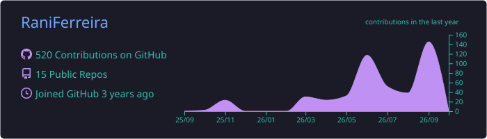
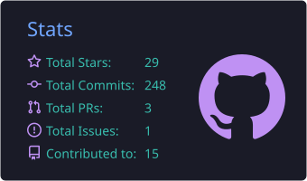
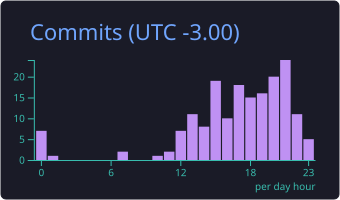
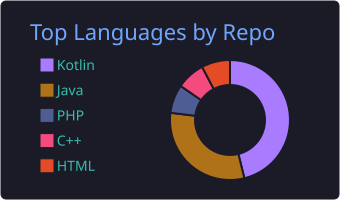
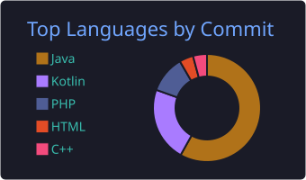

<div align="center">

<a href="https://git.io/typing-svg">
  
</a>

<br/>

<a href="https://www.linkedin.com/in/ranielly-ferreira-b05945251/"></a>
<a href="https://www.instagram.com/rani.ferreira1/"></a>
<a href="https://discord.com/channels/@me/1223815972574593034"></a>
<a href="mailto:raniellyf535@gmail.com"></a>


<br/><br/>


<sub>Me and Escaminha, my coding partner 🐾💜</sub>

</div>

---

## 👩‍💻 About me

<table>
<tr>
<td width="55%" valign="top">

```java
public record Developer(
    String name,
    String location,
    List<String> education,
    List<String> interests,
    String english
) {
    public static Developer ranielly() {
        return new Developer(
            "Ranielly Ferreira",
            "Minas Gerais, Brazil 🇧🇷",
            List.of(
                "Bachelor's in Systems Analysis & Development @ IFTM",
                "Technical Degree in Systems Analysis & Development @ Senac Minas"
            ),
            List.of("Backend", "Databases", "Web Development"),
            "A2 🇺🇸"
        );
    }
}
```

</td>
<td width="45%" valign="top">

☕ Building **backend systems** with Java & Spring  
🗄️ Interested in **backend** and **databases**  
🌐 Developing **web applications** with Angular & TypeScript  
🤖 Automating workflows with **AI tools**  
📋 Organizing projects with **Scrum** & **GitHub Projects**  
🌎 English: **A2** — and improving  
💜 Studying and evolving every day

</td>
</tr>
</table>

---

## 🧰 Tech Stack

<div align="center">

**💻 Languages & Web**


**🌿 Frameworks**


<br/>


**🗄️ Databases**


<br/>


**🛠️ IDEs & Tools**


<br/>


**🤖 Automation & AI**


**📋 Agile & Organization**


</div>

---

<div align="center">

## 📊 GitHub Stats

<div align="center">







</div>

---

### 💜 Thanks for visiting!

*"Learning is a journey, not a destination."*

</div>


